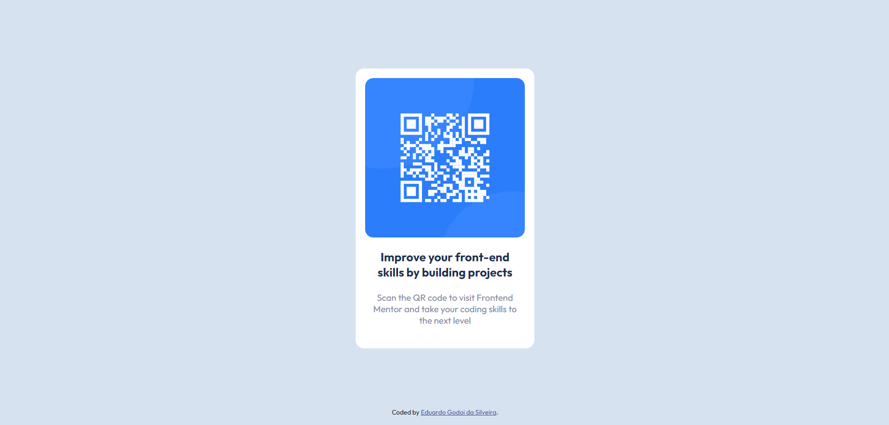

# Frontend Mentor - QR code component solution

This is a solution to the [QR code component challenge on Frontend Mentor](https://www.frontendmentor.io/challenges/qr-code-component-iux_sIO_H). Frontend Mentor challenges help you improve your coding skills by building realistic projects. 

## Table of contents

- [Overview](#overview)
  - [Screenshot](#screenshot)
  - [Links](#links)
- [My process](#my-process)
  - [Built with](#built-with)
  - [What I learned](#what-i-learned)
  - [Continued development](#continued-development)
- [Author](#author)

## Overview

### Screenshot

### Links

- Solution URL: [GitHub](https://github.com/GodoiTheCreator/QrCodeComponent)
- Live Site URL: [WebSite](https://godoithecreator.github.io/QrCodeComponent/)

## My process

### Built with

- Semantic HTML5 markup
- CSS custom properties
- Flexbox
- Mobile-first workflow

### What I learned

This time I changed my work process, creating the mobile layout first and then creating the desktop layout. I know this webpage is very basic but it was good to try by myself the Mobile-First workflow.

### Continued development

Probably I'll try create webpages using Mobile-first workflow again in the next challenge because I think people are using their cellphones more to see websites, etc.

## Author

- Linkedin - [Eduardo Godoi da Silveira](https://www.linkedin.com/in/eduardo-godoi/)
- Frontend Mentor - [@GodoiTheCreator](https://www.frontendmentor.io/profile/GodoiTheCreator)
- GitHub - [GodoiTheCreator](https://github.com/GodoiTheCreator)

